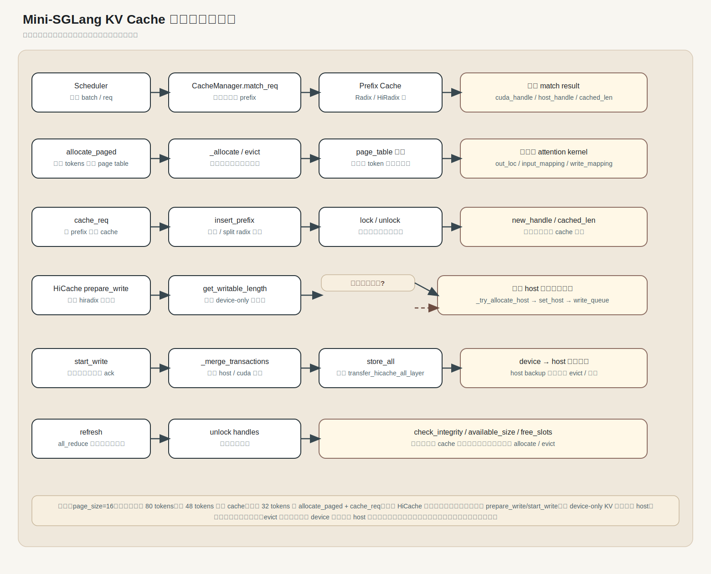

# KV Cache 全流程管理链路

这张图把 Mini-SGLang 的 KV cache 管理串成一条完整链路：请求匹配、页分配、prefix 插入、host 备份写回、加载回 HBM、驱逐回收，以及最后的完整性检查。

## 主链路对应代码

- 请求进入调度器后，先走 `CacheManager.match_req`，入口在 [python/minisgl/scheduler/cache.py](../python/minisgl/scheduler/cache.py#L39)
- 命中后的 prefix 会经过 `CacheManager.cache_req` 写回 cache，并可能触发 HiCache 的写回路径，代码在 [python/minisgl/scheduler/cache.py](../python/minisgl/scheduler/cache.py#L70)
- prefix cache 的插入、锁定、驱逐分别由 `BasePrefixCache` 的实现负责，接口定义在 [python/minisgl/kvcache/base.py](../python/minisgl/kvcache/base.py#L56)
- 普通 radix 路径在 [python/minisgl/kvcache/radix_cache.py](../python/minisgl/kvcache/radix_cache.py#L90)，HiRadix 路径在 [python/minisgl/kvcache/hiradix_cache.py](../python/minisgl/kvcache/hiradix_cache.py#L135)
- HiCache 的 host 备份写回与加载由 [python/minisgl/hicache/controller.py](../python/minisgl/hicache/controller.py#L46) 组织

## 一个具体例子

假设：

- `page_size = 16`
- 某个请求输入长度是 `80` tokens
- 前面 48 tokens 已经在 cache 中命中
- 这次 prefill 后，缓存需要扩展到 80 tokens

那么流程会是：

1. 调度器用 `match_req` 找到已命中的 prefix，命中长度是 `48`。
2. `allocate_paged` 为新增的 `32` tokens 分配页表空间。
3. `cache_req` 把 `[48, 80)` 这段插入 prefix cache；如果是 HiCache，并且可写长度超过阈值，就进入 `prepare_write`。
4. `prepare_write` 会先算出需要写回的连续 device-only 区间，再申请 host 空间。
5. `start_write` 把写事务送到独立写流，最终通过 `transfer_hicache_all_layer` 把 KV 从 device 拷到 host。
6. 后续如果显存紧张，`evict` 可以回收 device 侧页，而 host 侧仍保留备份。

你可以把这个例子理解成：**48 tokens 是已知缓存，后 32 tokens 是新扩展，write_back 的目标是把“本来只在 device 上的热数据”提前备份到 host**。
