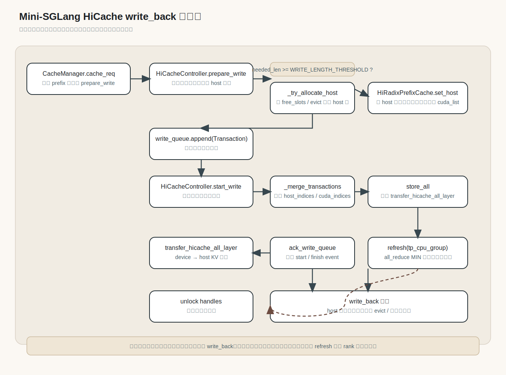

# HiCache write_back 调用链

下面这张图展示了 `write_back` 在 Mini-SGLang 里的核心调用路径：从调度器插入缓存、判断可写长度、分配 host 空间、发起异步写回，到最终通过 `refresh` 确认完成并解锁句柄。

关键节点对应的代码位置：

- `CacheManager.cache_req` 会在插入 prefix 后触发 `prepare_write`，入口在 [python/minisgl/scheduler/cache.py](../python/minisgl/scheduler/cache.py#L80)
- `HiCacheController.prepare_write` / `start_write` 负责组织写事务与异步写回，代码在 [python/minisgl/hicache/controller.py](../python/minisgl/hicache/controller.py#L168)
- `HiRadixPrefixCache.get_writable_length` / `set_host` 负责判断和登记需要回写到 host 的节点，代码在 [python/minisgl/kvcache/hiradix_cache.py](../python/minisgl/kvcache/hiradix_cache.py#L263)
- `refresh` 通过 `all_reduce` 统一确认写完成并解锁句柄，代码在 [python/minisgl/hicache/controller.py](../python/minisgl/hicache/controller.py#L235)
